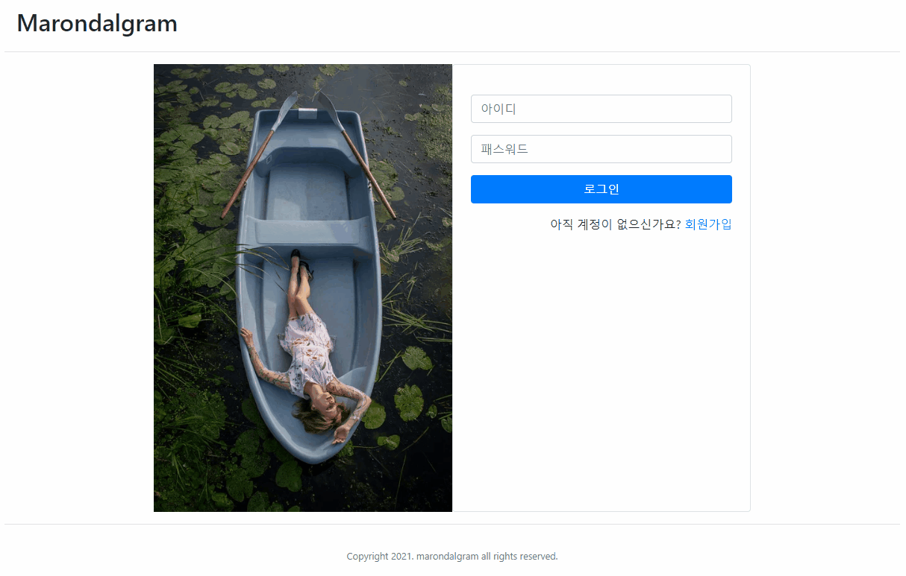
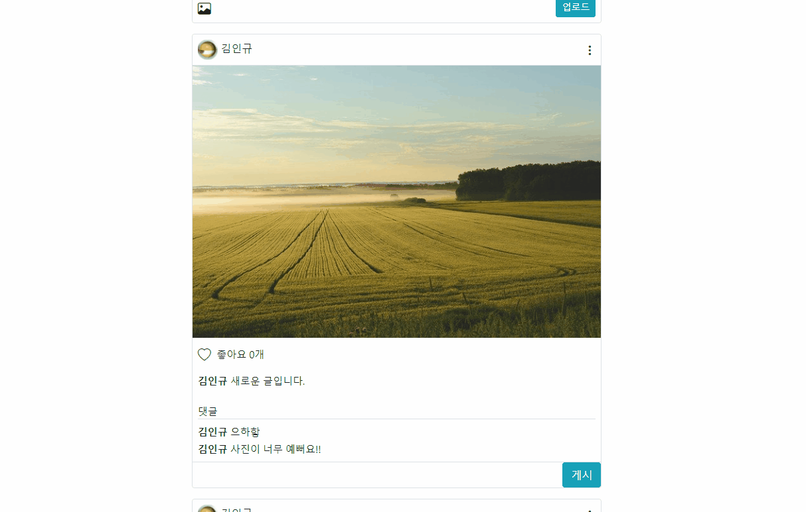

  

## 📢 마론달 그램

### 🖼 프로젝트 설명
 * 웹 서비스를 개발 경험을 쌓기 위해서 instragram를 복제한 프로젝트 개발
 * 기본적인 로그인 기반의 SNS 기능 
 
 ### 👩‍🏫 포트폴리오 
 
 [포트폴리오](portfolio.pptx) 
 
 ### 🛠 설계 🛠
  * UI 기획  
    https://ovenapp.io/project/MEoDuSsYW8NUBUR7wH788CN5yck53bCz#IMbQe  
    
  * 데이터 베이스, URL 설계  
    https://docs.google.com/spreadsheets/d/1HUEipabdYj0QCdX1knke_diHbDzr5LrX-AHYamDCuzM/edit#gid=0  
 
 ### ⛏ 주요기능 ⛏
 * 회원가입
   * package : [com.hagulu.marondalgram.user.*](https://github.com/dulumary/spring_marondalgram_0817/tree/develop/src/main/java/com/hagulu/marondalgram/user)
   * view : [/webapp/WEB-INF/jsp/user/*](https://github.com/dulumary/spring_marondalgram_0817/tree/develop/src/main/webapp/WEB-INF/jsp/user)
 * 로그인
   * package : [com.hagulu.marondalgram.user.*](https://github.com/dulumary/spring_marondalgram_0817/tree/develop/src/main/java/com/hagulu/marondalgram/user)
   * view : [/webapp/WEB-INF/jsp/user/*](https://github.com/dulumary/spring_marondalgram_0817/tree/develop/src/main/webapp/WEB-INF/jsp/user)
 * 이미지 첨부 글쓰기
   * package : [com.hagulu.marondalgram.post.*](https://github.com/dulumary/spring_marondalgram_0817/tree/develop/src/main/java/com/hagulu/marondalgram/post)
   * view : [/webapp/WEB-INF/jsp/post/*](https://github.com/dulumary/spring_marondalgram_0817/tree/develop/src/main/webapp/WEB-INF/jsp/post)
 * 댓글 
   * package : [com.hagulu.marondalgram.post.comment.*](https://github.com/dulumary/spring_marondalgram_0817/tree/develop/src/main/java/com/hagulu/marondalgram/post/comment)
   * view : [/webapp/WEB-INF/jsp/post/*](https://github.com/dulumary/spring_marondalgram_0817/tree/develop/src/main/webapp/WEB-INF/jsp/post)
 * 좋아요
   * package : [com.hagulu.marondalgram.post.like.*](https://github.com/dulumary/spring_marondalgram_0817/tree/develop/src/main/java/com/hagulu/marondalgram/post/*)
   * view : [/webapp/WEB-INF/jsp/post/*](https://github.com/dulumary/spring_marondalgram_0817/tree/develop/src/main/webapp/WEB-INF/jsp/post)

### 🎆 데모 🎆

 💎 회원 가입 및 로그인 
 

 💎 이미지 첨부 글쓰기
 
 
  💎 댓글쓰기
 
 
  💎 좋아요
 
 
### ✏ 외부 라이브러리 라이센스 ✏ 

* Tomcat [Apache License 2.0](https://www.apache.org/licenses/LICENSE-2.0) 
* Mysql [GPLv2 or proprietary](https://www.gnu.org/licenses/gpl-3.0.html)
* Spring framework [Apache License 2.0](https://www.apache.org/licenses/LICENSE-2.0)  
* Mybatis [Apache License 2.0](https://www.apache.org/licenses/LICENSE-2.0)
* Bootstrap [MIT License](https://opensource.org/licenses/MIT)
* jQuery [MIT License](https://opensource.org/licenses/MIT)
* 이미지 출처 : [pixabay](https://pixabay.com/ko/)

### 🎁 향후 계획
 * 개인 프로필 기능 추가 
 * 팔로우, 팔로워 기능 추가 
 * 사진 여러개 추가 기능

